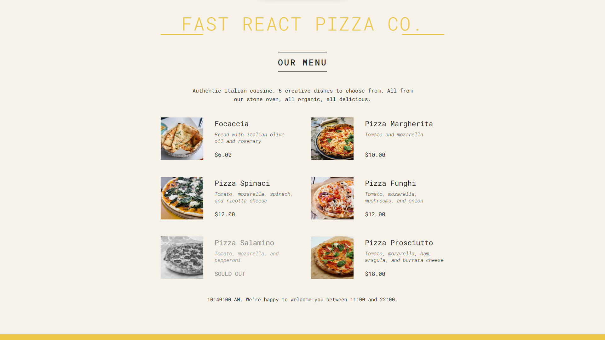

# Fast React Co.

A dinamic landing page for a pizzeria built with React and Vite

## About

This is one of the projects that I developed during my enrollment in the Jonas Schmedtmann's [React course](https://www.udemy.com/course/the-ultimate-react-course/). With this one I could learn about

- React foundations like functional components, props, JSX etc.
- Design principles of React components, like the separation of concerns between component logic, styling and UI, and the React aproach of abstracting those elements in a components tree;
- Using Vite as a bundler for web apps.

## Dependencies

Node: `v19.3.0`

## How to run locally

After downloading the source code, run

    npm install
    npm run dev
